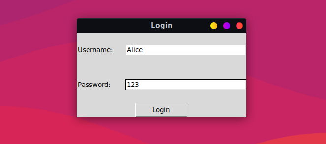

# Python Chat App


This is a chat application that allows multiple users to send and receive messages in real-time.

## Table of Contents
- [Features](#features)
- [Usage](#usage)
  - [Run the server](#run-the-server)
  - [Run the chat app](#run-the-chat-app)
  - [Login](#login)
  - [Send a message](#send-a-message)
  - [Logout](#logout)
- [How it works](#how-it-works)
- [Requirements](#requirements)
- [References](#references)


## Features

- Send and receive messages in real-time
- View the list of available users and their online status
- Send messages to a specific user
- Save chat history
- No multi-threading

## Usage

### Run the server

To run the server, use the following command:

```bash
python server.py
```

### Run the chat app

After running the server, you can run the chat app using the following command:

```bash
python chatapp.py
```

### Login

When you run the chat app, you will be prompted to enter your username and password. If the username and password are correct, you will be logged in and the chat window will appear.

There are 3 users already created, defined in the `users.json` file:

- User: `Alice`, password: `123`

- User: `Bob`, password: `456`

- User: `Charlie`, password: `789`



### Send a message

To send a message, simply click on the user you want to send a message to and type your message in the input field at the bottom of the window. Then press `Enter` or click the `Send` button.

The message will be displayed in the chat window on both the sender's and receiver's screens (if the receiver is online and she/he is not in the chat with anyone else).

The message will also be saved to a file called `history.json` in the same directory as the chat app.


### Logout

To logout, simply close the chat app window.

## How it works

The chat app uses the `tkinter` library for the GUI and the `socket` library for the network communication.

When you run the chat app, it connects to the server using a TCP socket. The server is responsible for handling the communication between clients.

The server keeps track of the logged-in users, their online status, transmits messages between users, and saves the chat history.

Data transmission between the client and the server is done using a simple protocol, which consists of the following steps:

- Construct a dictionary containing the message to be sent. Structure of the dictionary:

```python
{
    "purpose": "login", # purpose of the message, e.g. login, send_message, exit, etc.

    # other fields depending on the purpose
}
```

- Convert the dictionary to a string, then encode it to bytes. Now we call it `data`.

- Construct a packet containing the length of `data` and `data` itself. Structure of the packet:

```plaintext
$<length_of_data><data>$
```

- The packet is now ready to be sent over the network, using the `sendall` method of the socket object.

The destination (server or client) reads the packet, extracts the length of `data`, reads `data`, and decodes it back to a dictionary. Then it processes the message according to the purpose field.

The chat app uses a simple polling mechanism to check for new messages and updates from the server. It sends a request to the server every 100 milliseconds to check for new messages and updates.


## Requirements

- `tkinter` library (usually included in Python distributions)
- `socket` library (usually included in Python distributions)

## Contributing

Contributions are welcome! Please feel free to submit a Pull Request.

## License

This project is licensed under the MIT License. See the [LICENSE](LICENSE) file for details.


